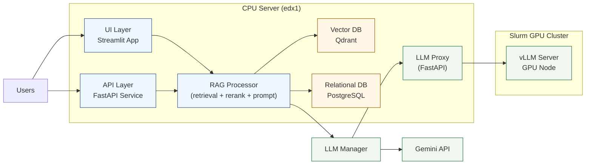
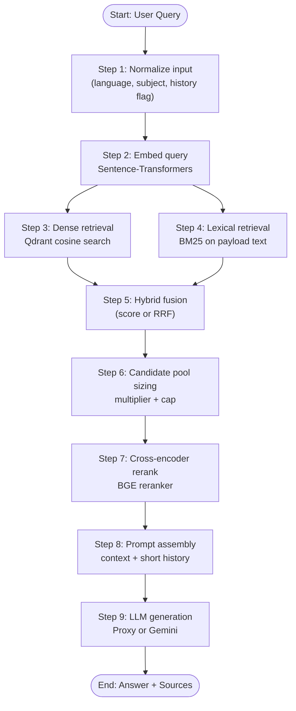
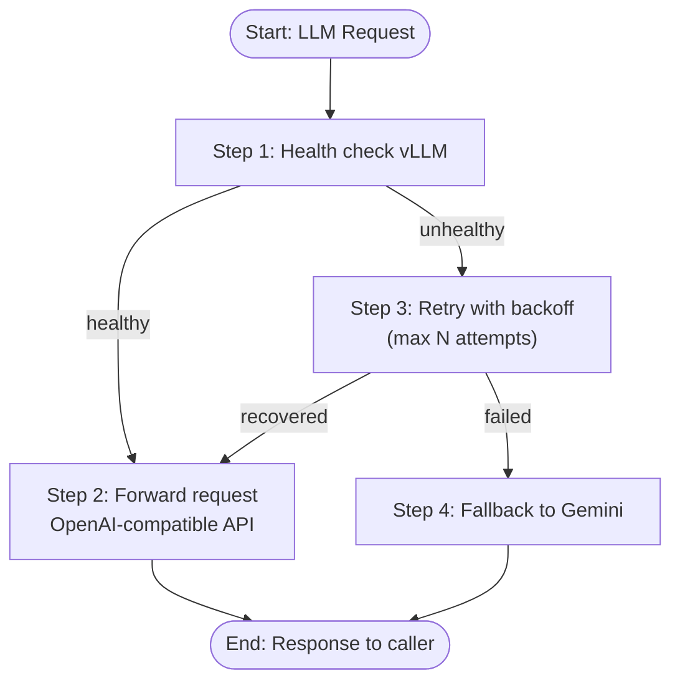
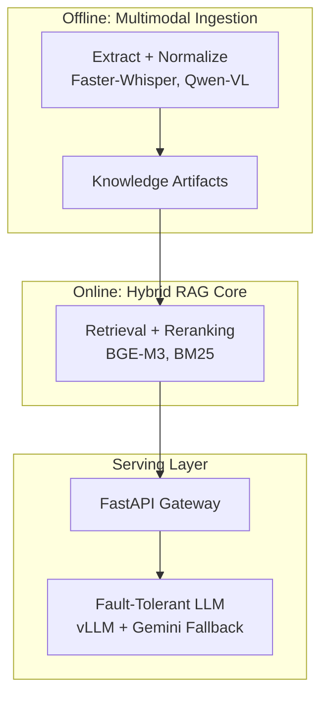

# IEEE-Style Diagrams (Mermaid)

## Figure 1. System Architecture Overview


```

## Figure 2. End-to-End Query Processing Pipeline (IEEE Stepwise)


```

## Figure 3. LLM Proxy Resilience Flow (IEEE Stepwise)



## Figure 4. Overall System Architecture (SoC: Offline vs Online)


```
